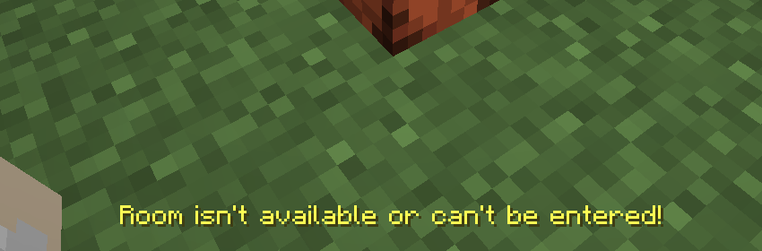

# Q & A
## I can't enter a pocket!
If this message is stated something went wrong:


### What to do?
This issue can happen when the custom dimension has not been loaded successfully.
1. Try restart your server.
2. You might need to activate custom dimensions somewhere. This could be caused by other mods, plugins or loaders. I cannot influence that behavior with my pack unfortunately.

To proof if thats the problem, try this command:

    /execute in pocket_dimension:realm if dimension pocket_dimension:realm

## How to remove the pocket display?
In case the custom dimension ```pocket_dimension:realm``` cannot be loaded you won't be able to break the pocket. This happens due to a failing verification process. This behaviour is not intended as the datapack is not designed to handle such errors. If it happens anyways you can use this command to remove them:

     /function pocket_dimension:remove_pocket_display

> [!warning]
> Do not use ```/kill @n[...]``` as this could potentionally damage or break the pocket dimension!

